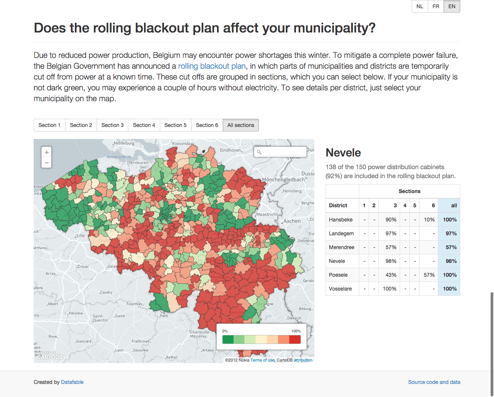

# Rolling blackout plan in Belgium

## Rationale

Due to reduced power production, Belgium may encounter power shortages this winter. To migitate a complete power failure, the Belgian Government has announced a **rolling blackout plan** ([afschakelplan](http://economie.fgov.be/nl/consument/Energie/Energiebevoorradingszekerheid/Crisisbeleid/elektriciteit/afschakeling/afschakelplan/#schijf_gemeente)/[plan de délestage](http://economie.fgov.be/fr/consommateurs/Energie/Securite_des_approvisionnements_en_energie/Politique_de_crise_coordination/electricite/delestage/plan-delestage/#.VBFTMmSSxgs)), in which municipalities and districts are temporarily cut off from power at a known time. These municipalities are grouped in sections (schijven/tranches). We found however, that neither the released data,  nor existing visualizations are very accessable or show a complete picture of the rolling blackout plan.

## Goal

Create an **complete**, **interactive**, **open source** visualization of the rolling blackout plan in Belgium.

## Result

<http://datafable.com/rolling-blackout-belgium/viz/>

## Data

* [Blackout data](data/blackout)
* [Geospatial data](data/geospatial)
* [How we combined the two](data/combined/README.md)

## License

[LICENSE](LICENSE)
